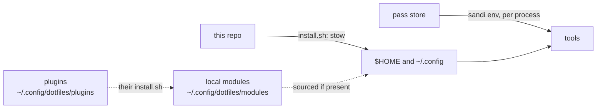

# dotfiles

One repo, identical on every macOS and Debian machine. Anything machine-specific lives outside it and is attached through optional hooks.

```bash
bash -c "$(curl -fsSL https://raw.githubusercontent.com/arisros/dotfiles/main/install.sh)"
# or, from a clone
./install.sh
```



## New machine

```bash
git clone git@github.com:arisros/dotfiles.git ~/dotfiles
cd ~/dotfiles && ./install.sh
zsh -i -c 'echo shell-ok'
```

`install.sh` also runs `sandi-setup.sh`, which only touches the password store when `SANDI_REMOTE` is set in a local module ([secrets](docs/secrets.md)).

## Docs

| Page | Covers |
|---|---|
| [architecture](docs/architecture.md) | repo to machine, install pipeline, stow map |
| [shell](docs/shell.md) | `.zshrc` load order, alias files, ssh agent socket |
| [secrets](docs/secrets.md) | `sandi`, sync, state, secret scanning, CI |
| [git and ssh](docs/git-ssh.md) | config layering, multiple GitHub accounts, agent forwarding |
| [desktop](docs/desktop.md) | AeroSpace, SketchyBar, borders, Karabiner, tmux and nvim |
| [plugins](docs/plugins.md) | attaching private, per-machine config |
| [reference](docs/reference.md) | install toggles, macOS vs Debian, C tooling, mermaid |
