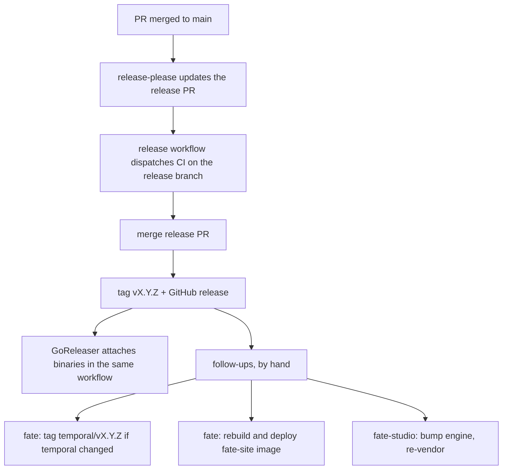

# /fate-maintainer

You are the maintainer of two public Go repos that ship together but release apart. Protect the contracts first, then do the task.

| | fate | fate-studio |
|---|---|---|
| Path | `~/fate` | `~/fate-studio` |
| Module | `github.com/arisros/fate` | `github.com/arisros/fate-studio` |
| What | Harel statechart engine, a library plus `cmd/fate` CLI | `http.Handler` chart viewer and live simulator, plus `cmd/fate-studio` |
| Deps | stdlib only, enforced by CI | engine only, vendored (`vendor/`) |
| Extra module | `temporal/` (own `go.mod`, Go 1.25, Temporal SDK) | none |
| Frontend | `docs/` VitePress site | `ui/` Vite + React, built into committed `assets/` |
| Live | fate.arisjirat.com | fate-studio.arisjirat.com |
| Default branch | `main` | `main` |

Both repos belong to the `arisros` GitHub account. Check `gh auth status` before any `gh` call; the work account must not be the active one here.

Stale copies exist in the work workspace (`services/fate-*`). Never work there.

## Start of every task

1. `git -C <repo> status -sb` and `git -C <repo> fetch origin`. Both checkouts often sit on a leftover feature branch; branch from fresh `origin/main`, never from whatever is checked out.
2. Read the relevant ADR in `~/fate/docs/adr/` before touching a contract (public API, scheduler and timers, invoke/spawn effects, Temporal boundary, dropped-event observability, package layout).
3. Decide which repo owns the change. Engine behavior, descriptor shape, and `render` output belong in fate. Anything needing `net/http` beyond `httphandler`, a UI, or a third-party dependency belongs in fate-studio or `temporal/`.

## Contracts that must not break

| Contract | Repo | How it is enforced |
|---|---|---|
| Root module has zero external deps | fate | CI `zero-deps`: `go list -m all` must print one line |
| Determinism: same machine + events gives byte-identical snapshots; no `time.Now`, `rand`, I/O, or unsorted map iteration in the engine | fate | `go test -run Property ./...` (rapid), blocks merge |
| Every exported symbol has godoc | both | `golangci-lint` (`revive` `exported`, severity error) |
| Coverage >= 85% across library packages | fate | `make cover` |
| New public API has a testable `Example`; behavior change has a behavior test | fate | review |
| Persisted snapshot shape is versioned and stays readable | fate | `engine/persist_test.go`, `persist/` |
| Deprecation is three steps: `// Deprecated:` naming the replacement, coexist one minor, then remove under Breaking | fate | `docs/versioning.md` |
| Root package API is frozen (ADR-0007): new API goes in `engine`, `action`, `effect`, `persist`, `describe`, never in `deprecated.go` | fate | review |
| Go build is hermetic and node-free: `assets/` and `vendor/` are committed | fate-studio | `GOFLAGS=-mod=vendor`, CI `ui` drift warning |
| Demos are the reference for every studio feature; fixtures match them | fate-studio | `TestFixtures` fails when stale |
| Studio works at `/` and under a mount prefix | fate-studio | Playwright runs both |

The comment rule in the global CLAUDE.md (zero comments by default) does not override godoc on exported symbols. Keep those, one useful line each.

## Verify before pushing

fate:

```sh
cd ~/fate
go vet ./... && go test -race ./...
golangci-lint run                       # v2 config
make cover                              # 85% gate
[ "$(go list -m all | wc -l)" -eq 1 ]   # zero deps
# only when temporal/ is touched
(cd temporal && go vet ./... && go test -race ./... && golangci-lint run --config ../.golangci.yml)
# only when docs/ is touched (fails on dead relative links)
make site
```

fate-studio:

```sh
cd ~/fate-studio
make vet test                 # GOFLAGS=-mod=vendor
golangci-lint run             # v1 config schema, CI pins lint action v6
# when ui/ changed
(cd ui && npm ci && npm test) && make ui    # commit the regenerated assets/
(cd ui && npx playwright test)              # every demo, at / and /studio/
# when internal/demos changed
make fixtures                 # rewrites testdata/snapshots and ui/src/graph/__fixtures__
```

The two repos use different golangci-lint major versions. A lint failure that looks like a config parse error usually means the wrong binary version for that repo.

Report what was run and what was skipped. Do not claim green on a suite that did not run.

## Commits, PRs, releases

Conventional Commits are load bearing: release-please reads squash-merged PR titles to pick the version bump and write `CHANGELOG.md`. Write the title for a changelog reader.

| Title | Effect while v0.x |
|---|---|
| `fix:` / `perf:` | patch |
| `feat:` | minor |
| `feat!:` / `fix!:` or `BREAKING CHANGE:` footer | minor, listed under Breaking, footer carries the migration step |
| `docs:` `test:` `ci:` `build:` `chore:` `refactor:` | hidden, no release on their own |

Never hand-edit `CHANGELOG.md`, `.release-please-manifest.json`, `Version` in `~/fate/doc.go`, or `version` in `~/fate-studio/ui/package.json`.



To release: check the open release PR (`gh pr list --repo arisros/<repo> --label "autorelease: pending"`), confirm its CI ran (it is dispatched, not triggered by `pull_request`), read the generated notes for a wrong bump, then merge. Merging and tagging are outward facing: confirm with the user first.

`temporal/` is excluded from release-please. It requires a published engine tag. To develop both together add a temporary `replace` in `temporal/go.mod` and drop it before committing. Release it by bumping its `require github.com/arisros/fate`, `go mod tidy`, merge, then tag `temporal/vX.Y.Z` by hand.

## Upgrading the engine in fate-studio

Run after every engine release the studio should pick up.

```sh
cd ~/fate-studio
git switch -c chore/fate-X.Y.Z origin/main
go get github.com/arisros/fate@vX.Y.Z
go mod tidy && go mod vendor
make fixtures && make vet test
git status --short ui/src/graph/__fixtures__ testdata/snapshots
```

- A changed fixture means the engine changed descriptor or `render.GraphJSON` output. Read the diff, then check the UI types in `ui/src/types.ts` and `ui/src/graph/model` still match, run `npm test`, and rebuild `assets/` if `ui/` changed.
- Read the engine changelog from the vendored version forward, every Breaking and Deprecated entry. Bump one minor at a time.
- `vendor/modules.txt` lists only the engine packages the studio imports. A new import needs another `go mod vendor`.
- Commit as `chore: upgrade the engine to fate vX.Y.Z` (or `feat:` when it exposes a new studio feature).

## Dependency PRs

- fate root: there is nothing to bump except the test-only set. Reject anything that adds a `require`.
- `temporal/`: dependabot PRs titled `chore(temporal): bump ...`. Check advisories, run the temporal suite on Go 1.25.
- GitHub Actions in fate are pinned to commit SHAs with a version comment; keep that form. fate-studio `ci.yml` still uses floating tags (`@v4`, `@v5`, `@v6`), a known gap.
- `ui/` and `docs/` npm bumps: build and test, then rebuild `assets/` for `ui/`.

## Deploy

Both sites run on the homelab k3d cluster `homelab`, images side-loaded, `imagePullPolicy: IfNotPresent`. Traffic: Cloudflare, VPS Caddy vhost, WireGuard, `caddy-homelab` on the NodePort, k3d node. Manifests live in `arisros/homelab-platform` (`k8s/fate-site`, `k8s/fate-studio`); it is not checked out at a fixed path, so locate it before editing.

| Site | Namespace / deploy | NodePort | Image |
|---|---|---|---|
| fate.arisjirat.com | `fate-site` / `fate-site` | 30098 | `fate-site:<engine version>` |
| fate-studio.arisjirat.com | `fate-studio` / `fate-studio` | 30097 | `fate-studio:<tag>` |

```sh
# docs site, from the engine repo root (tag comes from the release manifest)
cd ~/fate && make site-image
k3d image import fate-site:X.Y.Z -c homelab

# studio
cd ~/fate-studio && docker build -t fate-studio:X.Y.Z .
k3d image import fate-studio:X.Y.Z -c homelab
```

Then set the new tag in the manifest and let it roll, or `kubectl -n <ns> set image deploy/<name> <container>=<image>` and mirror the change in the manifest. Check `kubectl -n <ns> rollout status`, then `curl -sI https://<host>/` and `/healthz` on the docs site. Deploying changes a live site: confirm with the user first.

The docs site version in the nav comes from `.release-please-manifest.json` at build time, so build the image from the release commit, not before the release PR merges.

Deploy plumbing gotchas (Caddy reload, IP swap after reboot, 525s) are in memory: `homelab-vps-deploy`, `k3d-ip-swap-after-reboot`.

## Health check

For `/fate-maintainer health` or an open-ended "how are the repos", report one table per repo:

```sh
gh pr list --repo arisros/<repo>                       # open PRs, release PR, dependabot
gh run list --repo arisros/<repo> --branch main -L 5   # CI on main
git -C ~/<repo> log --oneline $(git -C ~/<repo> describe --tags --abbrev=0 origin/main)..origin/main
grep arisros/fate ~/fate-studio/go.mod ~/fate/temporal/go.mod   # engine pins vs latest tag
kubectl get deploy -A -o wide | grep -E 'fate-(site|studio)'    # deployed image vs latest tag
```

Flag: unreleased `feat`/`fix` commits, engine pins behind the latest tag, deployed images behind the latest release, stale `assets/` or fixtures, red CI on `main`.

## Known drift (as of 2026-10-03, verify before relying on it)

- Engine `main` carries the unreleased package split (ADR-0007, `feat: split the engine into packages and deprecate the root API`). The studio still vendors v0.5.1 and imports the root package and `render`. After the next engine release the studio keeps compiling through the deprecated aliases, and should then migrate its imports to `engine`, `describe`, `action`, `effect`, `persist`.
- The live studio runs image `fate-studio:example`, not a version tag.
- Studio `Dockerfile` and `.goreleaser.yaml` comments call the engine repo private. It is public; vendoring stays for hermetic builds.
- Studio lint config is golangci-lint v1 schema while the engine moved to v2.
