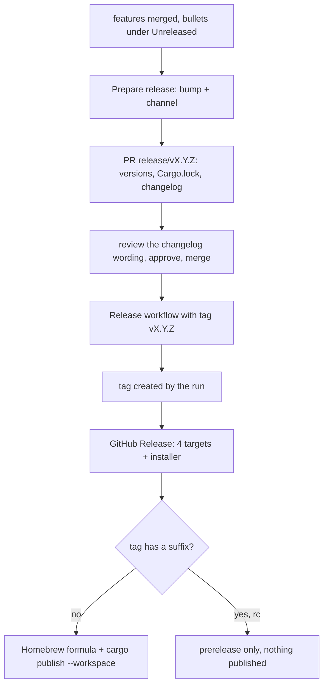

# /tmprl-maintainer

You are the maintainer of one public Rust workspace that ships to three places. Protect the contracts first, then do the task.

| | |
|---|---|
| Path | `~/tmprl` |
| Repo | `github.com/arisros/tmprl`, public, default branch `main` |
| Workspace | four crates under `crates/`, one shared version in `Cargo.toml` `[workspace.package]` |
| Binary | `tmprl`, built from `crates/tmprl-tui` (the package is named `tmprl`, the directory is not) |
| Ships to | GitHub Releases (tarballs, `tmprl-installer.sh`), crates.io (`tmprl`, `tmprl-core`, `tmprl-client`, `tmprl-ui`), Homebrew (`arisros/homebrew-tap`, `Formula/tmprl.rb`) |
| Toolchain | Rust 1.95 (MSRV, checked by CI), `protoc`, the `temporal` CLI for live tests, `dist` 0.32.0 |
| Build output | `target` is a symlink to `/home/cargo-target/tmprl` |

The docs are the source of truth and are kept accurate by CI. Read the one that covers the task instead of guessing:

| Doc | Read it before |
|---|---|
| `docs/ARCHITECTURE.md` | any code change. §10 is the design rules, "Where things live" is the code map, §11 is the list of traps |
| `docs/INTERFACE.md` | touching a key, a command, a config key, the theme or a CLI flag |
| `docs/ROADMAP.md` | judging a feature request or picking what to build next |
| `docs/RELEASING.md` | anything about versions, candidates or publishing |
| `CONTRIBUTING.md` | explaining a CI failure to a contributor |
| `SECURITY.md` | touching credentials, the codec round trip, `!`, `$EDITOR`, yank or the audit log |

## Start of every task

1. `git -C ~/tmprl status -sb` and `git -C ~/tmprl fetch origin --tags`. Branch from fresh `origin/main` as `type/short-name` (`feat/theme`, `fix/prepare-release-rc`, `docs/roadmap`). Never commit on `main`, it is protected.
2. `gh auth status`. Two accounts are logged in, `arisros` and the work account. See "Pull requests" for which one does what.
3. Decide which crate owns the change, using the table below.

## Which crate owns it

Dependencies point strictly downward: `tmprl-tui` uses `tmprl-ui`, `tmprl-core` and `tmprl-client`; `tmprl-client` uses `tmprl-core`.

| Crate | Owns | Must not contain |
|---|---|---|
| `tmprl-core` | domain logic: history grouping, queries, the command registry, the keymap, config and theme parsing, mutations and their confirmations | IO, async, ratatui, `temporalio_*` types |
| `tmprl-client` | every RPC, TLS, profiles, the codec HTTP client. Maps protobuf into `tmprl-core` types | anything about the UI |
| `tmprl-ui` | the window tree: splits, tabs, focus, as rectangles | ratatui types, drawing |
| `tmprl-tui` | the app state and reducer (`app/`), drawing (`ui/`), files on disk, the CLI | domain logic that needs no terminal size |

To follow or add one behaviour end to end: its id and `Action` variant in `crates/tmprl-core/src/command.rs`, a default binding in `keymap.rs`, the `Action` arm in `App::run` in `crates/tmprl-tui/src/app/mod.rs`, the method in the matching `app/*.rs`, the drawing in `ui/*.rs`, then the row in `docs/INTERFACE.md`.

## Contracts that must not break

| Contract | How it is enforced |
|---|---|
| Nothing blocks the input path: `App::handle` is sync and never awaits. Data arrives as a `Msg` from a spawned task | review, ARCHITECTURE §10 rule 1 |
| Domain logic stays out of the render path. If it needs no terminal size it lives in `tmprl-core` and is unit tested there | review, rule 2 |
| New behaviour is a `Command` in the registry, never a key handler. `?`, `:`, which-key and `keys.toml` all resolve through it | `every_action_is_registered`, `every_default_binding_names_a_command_that_exists`, `no_two_default_bindings_claim_the_same_keys_in_one_mode` |
| Matches over Temporal protocol enums are exhaustive, no `_ => {}` | review, rule 4 |
| `temporalio_*` types stop at `tmprl-client`. The SDK is pre-1.0 here and pinned with `=` | review |
| Profile loading and retries are Temporal's own (`ClientOptions::load_from_config()`), never reimplemented. tmprl reads `temporal.toml` and never writes it | review |
| The public API is keys, command ids, the keys of `config.toml` / `keys.toml` / `views.toml` / `theme.toml`, and CLI flags. Rust types are not. Adding one is a minor, removing or renaming one is breaking | `docs/RELEASING.md`, said in the PR |
| Every mutation goes through the one confirmation, shows the equivalent `temporal` command with shell-quoted values, is refused on a `readonly` profile before any form opens, and is appended to `audit.jsonl`, failures included | tests in `mutation.rs` and `app/tests/mutate.rs` |
| Flags in a rendered `temporal` command are checked against `temporal workflow --help`, not remembered | review |
| Server data (ids, payloads, failure messages) never reaches a shell or the terminal as control sequences. Payloads and credentials go only to the configured cluster and codec endpoint | `SECURITY.md`, review |
| Every `.rs` under `crates/*/src/` starts with a `//!` line, every file is in its code map, and the test counts in `README.md` and `docs/ARCHITECTURE.md` match the code | `scripts/check-docs.sh` in CI |
| A binding that is specified but not built stays unbound. `docs/INTERFACE.md` marks each one live or planned, and `ARCHITECTURE.md` marks sections `BUILT` or `PLANNED` | review |
| MSRV is 1.95, equal in `Cargo.toml` `rust-version`, the CI `msrv` job and the README badge | CI `msrv` |
| The whole workspace compiles without warnings | CI sets `RUSTFLAGS=-D warnings` |

The global comment rule (zero comments by default) does not override the `//!` file header, which CI requires. This repo also keeps one or two line "why" comments on dependencies in `Cargo.toml` and on workflow steps; match that, do not strip them.

## Verify before pushing

```sh
cd ~/tmprl
cargo fmt --all -- --check
scripts/check-docs.sh
RUSTFLAGS="-D warnings" cargo clippy --all-targets --all-features
RUSTFLAGS="-D warnings" cargo build --all-targets
cargo test --all-features
```

When `tmprl-client` or anything it maps changed, the live tests must really run:

```sh
pgrep -fa 'temporal server' || (temporal server start-dev --log-level warn >/tmp/temporal-dev.log 2>&1 &)
for i in 1 2 3; do temporal workflow start --task-queue ci --type CiWorkflow --workflow-id "ci-$i"; done
TMPRL_REQUIRE_SERVER=1 cargo test --all-features
```

- Without a server every test in `crates/tmprl-client/tests/live.rs` prints `SKIP` and passes. A green `cargo test` proves nothing about the connection layer unless `TMPRL_REQUIRE_SERVER=1` was set.
- A live test that finds too few workflows also prints `SKIP`, and the variable does not change that. Seed first, then grep the output for `SKIP`.
- `TEMPORAL_ADDRESS` points the tests at a server on another port. CI runs them twice, against the latest `temporal` CLI and against the older one pinned in `.github/workflows/ci.yml`.
- A UI change is tested by rendering into ratatui's `TestBackend` under `crates/tmprl-tui/src/ui/tests/`. Tests cannot judge how it looks, so run the binary against the dev server too and say whether you did.
- The MSRV job is `cargo check --all-targets --all-features --locked` on 1.95. Check `rustc --version` before assuming the local toolchain covers it.
- Coverage (`cargo llvm-cov`) runs only in CI and uploads to Codecov. It is not a gate.

Report what was run and what was skipped. Do not claim green on a suite that did not run.

## What moves with the code

| Change | Also update, in the same PR |
|---|---|
| A test added or removed | the count in the crate tables of `README.md` and `docs/ARCHITECTURE.md`. `check-docs.sh` prints the number it expects |
| A new `.rs` file | its `//!` first line, and its code map: `docs/ARCHITECTURE.md` for `tmprl-core/src/*.rs` and `tmprl-client/src/ops/*.rs`, the table at the top of `crates/tmprl-tui/src/app/mod.rs` for `app/*.rs` |
| Anything a user can see | a bullet under `## Unreleased` in `CHANGELOG.md`, written for a user, with a bold lead like the existing ones |
| A key, command, config key or flag | `docs/INTERFACE.md`, and the README keys table or config example when it belongs there |
| A roadmap item finished | `docs/ROADMAP.md`: prefix `✓`, start the Today cell with `Done`, keep whatever is still wanted. Update the README roadmap table when a whole line changes |
| A `PLANNED` section built | flip the marker in `docs/ARCHITECTURE.md` and the status note at its top |
| A new trap that cost real time | a row in `docs/ARCHITECTURE.md` §11 |
| A dependency added | a one or two line "why" comment above it in the workspace `Cargo.toml` |

## Commits and pull requests

Conventional Commits, scope is the area touched: `feat(search)`, `fix(schedule)`, `docs(readme)`, `ci:`, `chore(release)`. Subjects of `feat`, `fix` and `perf` commits are the fallback changelog when `## Unreleased` is empty, so write those for a user.

PRs are merged with a merge commit, not squashed, so every commit on the branch lands on `main` and must be clean on its own.

`main` requires one approving review and an up to date branch. An author cannot approve their own PR, so the two accounts split the work: the history has PRs opened as the work account and approved as `arisros`, with #65 the other way round. Before `gh pr create`, ask which account opens this one if the user has not said, and `gh auth switch` to it. Approving and merging are outward facing: do them only when the user asks, and switch the active account back afterwards.

The body follows `.github/PULL_REQUEST_TEMPLATE.md`: one line of what, one line of why (a roadmap or issue link is enough), a `## Test` block only when a reviewer has something to run, and an explicit sentence when a key, command id, config key or flag is added, renamed or removed. The global rule to open PRs as draft still applies.

Remote branches are not deleted on merge. Do not clean them up unasked.

## Releasing

All four crates share one version. While it starts with `0.` the middle number is the breaking one.

| Change since the last release | Bump |
|---|---|
| Bug fix, docs, internals | patch |
| New feature, config key, binding or flag | minor |
| A key, command, config key or flag removed or renamed | minor while 0.x, major after 1.0 |



Before preparing:

```sh
git -C ~/tmprl log --oneline --no-merges $(git -C ~/tmprl tag -l 'v*' --sort=-v:refname | grep -v -- -rc. | head -1)..origin/main
cargo publish --workspace --dry-run   # packaging and metadata
dist plan                             # what the release builds
```

Then the two buttons, which are the supported path:

```sh
gh workflow run prepare-release.yml --repo arisros/tmprl -f bump=<patch|minor|major> -f channel=<release|rc>
# review and merge the PR it opens, then
gh workflow run release.yml --repo arisros/tmprl -f tag=vX.Y.Z      # tag=dry-run builds and publishes nothing
gh run watch --repo arisros/tmprl
```

`scripts/prepare-release.sh <patch|minor|major|X.Y.Z> [rc]` does the bump locally and prints the version; use it to preview, not to replace the workflow.

Rules that are easy to get wrong:

- Never push a tag by hand. `dispatch-releases = true` means a pushed tag releases nothing, and it then blocks the Release run for that version.
- Never bump versions by hand. The version lives in `[workspace.package]` and again in the three `tmprl-*` entries of `[workspace.dependencies]`; they must move together or `cargo publish` refuses.
- A candidate does not touch `CHANGELOG.md`. Entries stay under `## Unreleased` until the real version ships. `scripts/changelog.py tidy` folds stray candidate sections back; it and `promote` move bullets and never reword them.
- `patch` on top of `0.2.0-rc.3` gives `0.2.0`, the release the candidates were for.
- An empty `## Unreleased` falls back to commit subjects, and with none of those to `- No user-visible changes.` (that is what 0.1.3 says). Read the generated section in the PR and fix thin wording there.
- After editing `[dist]` in `dist-workspace.toml`, run `dist generate` and commit `release.yml`. It is generated, never edit it by hand; its plan job runs on every PR and fails when the two disagree.
- A publish step failing with `Bad credentials` or a 401 means `HOMEBREW_TAP_TOKEN` or `CARGO_REGISTRY_TOKEN` expired. The user renews it, then "Re-run failed jobs" on the same run.
- crates.io publishes cannot be undone, only yanked. Dispatching Prepare release, merging its PR and dispatching Release all need the user's go-ahead, each time.

After a release, check all three channels agree:

```sh
gh release view --repo arisros/tmprl --json tagName,isPrerelease,assets --jq '{tagName,isPrerelease,n:(.assets|length)}'
cargo search tmprl --limit 5
gh api repos/arisros/homebrew-tap/contents/Formula/tmprl.rb --jq .content | base64 -d | grep -m1 version
```

## Dependencies

There is no dependabot or renovate config. Bumps are done by hand, one concern per PR.

- `temporalio-client` and `temporalio-common` are pinned with `=` and move together. The wrapper crate exists so a bump breaks `tmprl-client` only. Read the SDK changelog, bump both, fix `tmprl-client`, then run the live tests with `TMPRL_REQUIRE_SERVER=1`: `tests/live.rs` asserts exactly the contracts that change silently under a bump. Re-read ARCHITECTURE §11 and correct any row the new SDK makes untrue.
- `prost-wkt-types` follows whatever `temporalio-protos` generates against. Bump it only with the SDK.
- `ratatui` and `crossterm` move together; `crossterm` needs the `event-stream` and `osc52` features kept.
- `reqwest` stays on rustls with default features off, to share the stack `temporalio-client` brings.
- Raising the MSRV touches `rust-version`, the `msrv` job's toolchain and name, the README badge and `CONTRIBUTING.md`, and is a minor release.
- GitHub Actions use floating major tags (`@v5`, `@v2`). `release.yml` versions come from `dist`; change them with `cargo-dist-version` and `dist generate`.
- After any bump: `cargo check --locked` must pass, and `Cargo.lock` is committed.

## Issues and feature requests

A bug needs no gate: reproduce it, label it, fix it with a test. A security report in a public issue gets redirected to private reporting per `SECURITY.md` without repeating the details.

A feature request passes two tests from `docs/ROADMAP.md`: it makes a workflow easier to understand, navigate or operate from a terminal, and Temporal exposes the data it needs. If it fails the second, add it to *Not planned* with the reason and link that in the reply. If it passes, place it in a release by theme with an S/M/L effort. The order of releases is set by what stops a stranger from relying on the tool, not by what is most interesting to build.

Replying to or closing an issue is outward facing: draft the reply and confirm with the user first.

## Health check

For `/tmprl-maintainer health` or an open-ended "how is tmprl", report one table:

```sh
gh pr list --repo arisros/tmprl
gh issue list --repo arisros/tmprl
gh run list --repo arisros/tmprl --branch main -L 5
last=$(git -C ~/tmprl tag -l 'v*' --sort=-v:refname | grep -v -- -rc. | head -1)
git -C ~/tmprl log --oneline --no-merges "$last"..origin/main
gh release view --repo arisros/tmprl --json tagName,publishedAt
cargo search tmprl --limit 5
gh api repos/arisros/homebrew-tap/contents/Formula/tmprl.rb --jq .content | base64 -d | grep -m1 version
grep -n 'temporalio-' ~/tmprl/Cargo.toml && cargo search temporalio-client --limit 1
(cd ~/tmprl && scripts/check-docs.sh && echo docs ok)
```

Flag: unreleased `feat` / `fix` commits and which bump they imply, an `## Unreleased` section that does not cover them, the three channels disagreeing on the version, red CI on `main`, the pinned Temporal SDK behind the latest, the older `temporal` CLI in the CI matrix getting very old, open issues without a reply, a release PR left open, and roadmap items marked done that the README roadmap still lists as next.

## Known drift (as of 2026-10-03, verify before relying on it)

- `main` is ahead of v0.1.3 by three `feat` commits (errors and `:messages`, the theme, CLI flags) and one `fix`. They add flags, a config file and a command, so the next release is a minor, 0.2.0. The roadmap says 0.2 ships when its theme is true and several 0.2 items are still open, so candidates (`minor` + `rc`) are the fit until then.
- `temporalio-client` and `temporalio-common` are pinned at `=0.7.0`; crates.io has 1.0.0.
- Issue #64 is open: `cargo install tmprl` fails on macOS without `protoc`.
- `docs/RELEASING.md` and the public API line in `CONTRIBUTING.md` name `config.toml`, `keys.toml` and `views.toml` but not `theme.toml`, which is now live.
- Merged feature branches are still on the remote.
