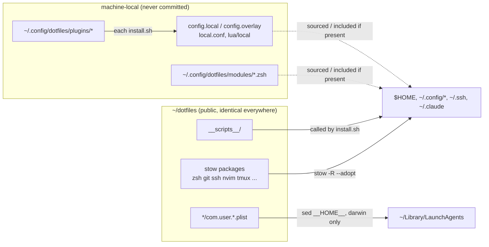
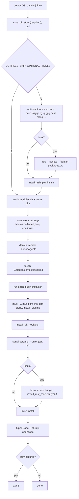

# Architecture

## Repo to machine

## install.sh

Every step checks before acting (`command -v`, `mkdir -p`, `stow -R`), so re-running is safe. `--adopt` is on by default: a real file already at a target is pulled **into the repo**, check `git diff` after a first run.

## Stow map

| Package | Target | OS |
|---|---|---|
| `zsh`, `git`, `vim`, `lynx`, `opencode` | `$HOME` | all |
| `ssh` | `~/.ssh` | all |
| `claude` | `~/.claude` | all |
| `nvim` `tmux` `alacritty` `ghostty` `herdr` `mise` `yazi` `htop` `nix` | `~/.config/<pkg>` | all |
| `aerospace` `borders` `sketchybar` | `~/.config/<pkg>` | darwin |

Target directories are created first, so stow links files into them instead of folding the whole directory into one symlink.

Not stowed: `karabiner` (see [desktop](desktop.md)), `joshuto`, `rainfrog`. The `Brewfile` is not applied by `install.sh`.

## Where to go next

| Topic | Page |
|---|---|
| zsh load order, local modules | [shell.md](shell.md) |
| secrets, sandi, secret scanning, CI | [secrets.md](secrets.md) |
| git identity, ssh accounts, agent forwarding | [git-ssh.md](git-ssh.md) |
| macOS window manager and keyboard stack | [desktop.md](desktop.md) |
| attaching private config | [plugins.md](plugins.md) |
| install toggles, Debian bridge, C tooling | [reference.md](reference.md) |
