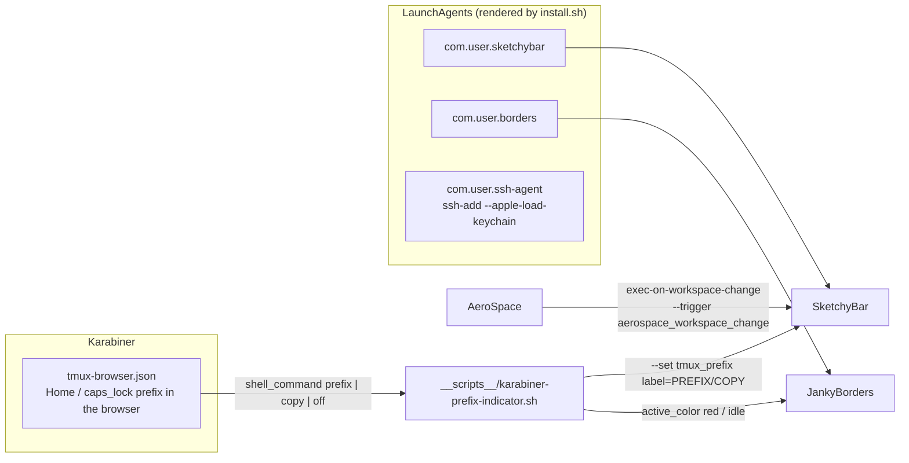
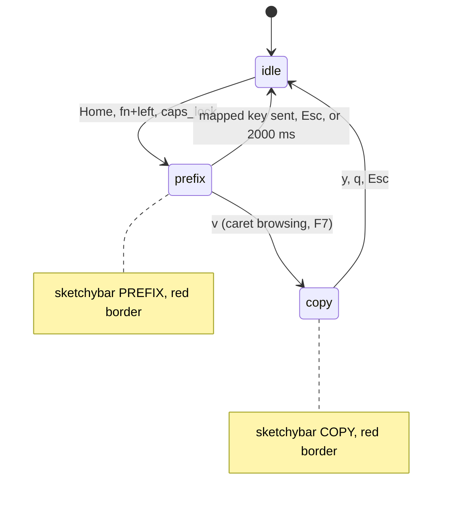
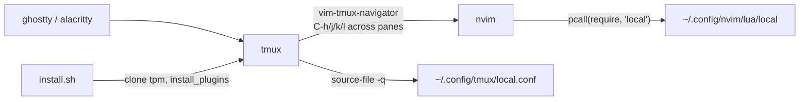

# Desktop (macOS)

Only darwin gets this stack. On Linux none of it is stowed.

## How the pieces talk



| Piece | Config | Started by |
|---|---|---|
| AeroSpace | `aerospace/aerospace.toml` | `start-at-login = true` |
| SketchyBar | `sketchybar/sketchybarrc` | LaunchAgent |
| JankyBorders | `borders/bordersrc` | LaunchAgent |
| Karabiner rules | `karabiner/tmux-browser.json` | merged by hand, see below |

`install.sh` writes the plists but never runs `launchctl load`; they start at next login.

## Browser prefix layer



The rules are **not** stowed and **not** applied by `install.sh`. Apply them after editing:

```bash
bash __scripts__/install_karabiner_rules.sh
```

Key map, copy-mode keys and design notes: [karabiner/README.md](../karabiner/README.md).

## Terminal



| Piece | Entry |
|---|---|
| tmux | `tmux/tmux.conf`; plugins via tpm (sensible, resurrect, continuum, vim-tmux-navigator, minimal-tmux-status, urlview, yank) |
| nvim | `nvim/init.lua` then `arisjirat.core`, `arisjirat.lazy` (lazy.nvim) |
| terminals | font and window only, no shell or tmux wiring |
