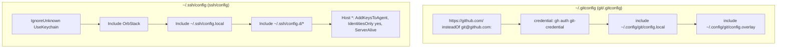
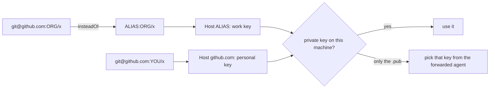
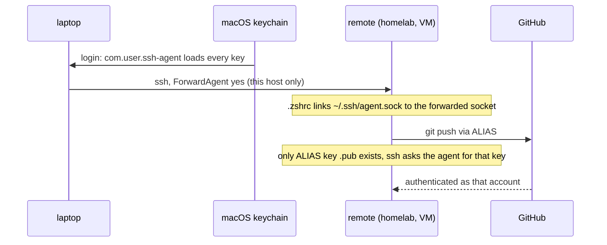

# Git and SSH

## Config layering

Git applies includes in order and the last value wins, so `config.overlay` beats `config.local`. ssh takes the **first** value, so the includes sit above `Host *`. Shapes: `git/config.local.example`, `ssh/config.local.example`. Include ordering pitfalls: [plugins.md](plugins.md).

## Multiple GitHub accounts

Repos are routed to an account by the org in the remote URL, not by the directory they are cloned into.

| Piece | Where |
|---|---|
| `url "<alias>:<org>/".insteadOf` | `~/.config/git/config.local` |
| `includeIf "hasconfig:remote.*.url:..."` for identity | `~/.config/git/config.local` or `.overlay` |
| `Host <alias>` with its own `IdentityFile` | `~/.ssh/config.local` |
| explicit `Host github.com` `IdentityFile` | `~/.ssh/config.local`, needed because `IdentitiesOnly yes` |

Check: `ssh -T git@github.com` and `ssh -T <alias>` each greet their own user. `git config --show-origin --get user.email` names the file that set the identity.

## Other machines, no private keys

1. Laptop: `ForwardAgent yes` on that one host in `~/.ssh/config.local`.
2. Remote: copy only the `.pub` files to `~/.ssh/`, reuse the same aliases.
