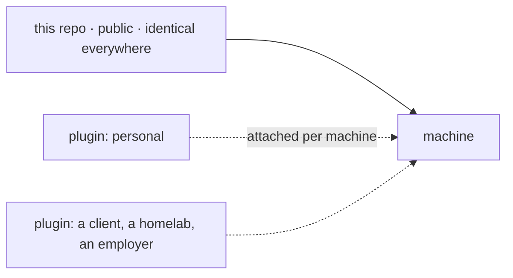

# Plugins

## Why

This repo is meant to be byte-identical on every machine. Anything that is not
identical everywhere - an identity, a host list, a client's tooling, a homelab's
service names - would either force per-machine branches or leak context into a
public repo. Both are worse than the alternative: keep that material in its own
repo and attach it.

A plugin is that separate repo. It brings its own `install.sh`, which links its
files into the hooks this repo already exposes. Nothing here names any plugin, so
a machine with none installed is a complete, working setup.



## Attaching one

```bash
git clone <plugin-repo> ~/my-plugin
mkdir -p ~/.config/dotfiles/plugins
ln -s ~/my-plugin ~/.config/dotfiles/plugins/my-plugin
./install.sh            # runs every plugin's install.sh after stowing
```

Detach by removing the symlink. Nothing breaks: every hook below is optional and
silent when its file is absent.

## Hooks a plugin can use

| Hook | Read by |
|---|---|
| `~/.config/dotfiles/modules/*.zsh` | `zsh/.zshrc`, after the alias files |
| `~/.config/git/config.local` | `git/.gitconfig` `[include]` |
| `~/.config/git/config.overlay` | `git/.gitconfig` `[include]`, for plugins |
| `~/.ssh/config.local` | `ssh/config` `Include`, above every `Host` block |
| `~/.ssh/config.d/*` | `ssh/config` `Include`, for plugins |
| `~/.config/tmux/local.conf` | `tmux/tmux.conf` `source-file -q` |
| `~/.config/nvim/lua/local/init.lua` | `nvim/init.lua` `pcall(require, "local")` |
| `~/.claude/context.local.md` | `claude/CLAUDE.md` import |
| `$DOTFILES_MODULES/forbidden-patterns.txt` | `__scripts__/scan_secrets.sh`, via the pre-commit hook |

Git has no glob for `[include]`, so a plugin appends its own line to
`~/.config/git/config.overlay` once, instead of owning the file:

```bash
include_git_config() {
  local target="$HOME/.config/git/config.overlay" path="$1"
  mkdir -p "$(dirname "$target")"; touch "$target"
  grep -qF "path = $path" "$target" || printf '[include]\n    path = %s\n' "$path" >> "$target"
}
```

Order matters, and getting it wrong is quiet. A plugin that sets `[user]`
unconditionally overrides every conditional rule included before it, because git
applies includes in order and the last value wins. So conditional identity has to
be included *after* any plugin that sets an identity: keep those rules in their
own file appended to `~/.config/git/config.overlay` last, not in
`~/.config/git/config.local`, which `git/.gitconfig` includes first. The symptom
is a work repo quietly committing with a personal email, with nothing to see in
either file on its own. `git config --show-origin --get user.email` names the
file that won.

Conditional includes let a plugin route identity by the repo's remote rather than
by the directory it sits in, which is what you want when one folder holds repos
from two accounts:

```gitconfig
[url "<alias>:<org>/"]
    insteadOf = git@github.com:<org>/
[includeIf "hasconfig:remote.*.url:git@github.com:<org>/**"]
    path = ~/.config/git/config.<name>
```

## Writing one

Requirements, all of them cheap:

- `install.sh` is idempotent and prompts for nothing. Re-running after a pull is
  the normal way to use it.
- It never overwrites a real file. Move it to `<name>.pre-plugin` and say so.
- It works on macOS and Debian, or gates the parts that cannot. `uname -s`.
- It only links; the plugin's repo stays the single copy of every file.

A minimal one:

```bash
#!/usr/bin/env bash
set -euo pipefail
PLUGIN="$(cd "$(dirname "${BASH_SOURCE[0]}")" && pwd)"
mkdir -p "$HOME/.config/dotfiles/modules"
ln -sfn "$PLUGIN/modules/mine.zsh" "$HOME/.config/dotfiles/modules/mine.zsh"
```

## Keeping a plugin's contents out of public view

Two options, and the choice is about what you are protecting.

**A private repo.** Nothing is published, and no key has to exist. This is the
right default for anything that is not yours to publish.

**A public repo with encrypted contents.** Use this when the repo has to live
under an account that cannot hold private repos, or when you want one place for
everything. [git-crypt](https://github.com/AGWA/git-crypt) (macOS: `brew install
git-crypt`, Debian: `apt install git-crypt`) encrypts by path:

```
# .gitattributes
git/**         filter=git-crypt diff=git-crypt
modules/**     filter=git-crypt diff=git-crypt
# left readable so a locked clone can still bootstrap
README.md      !filter !diff
install.sh     !filter !diff
```

```bash
git-crypt init
git-crypt export-key /tmp/plugin.key   # store it in a secret manager, then delete
git-crypt unlock /tmp/plugin.key       # on every other machine
```

What to know before choosing it:

- The ciphertext is public permanently. A key that leaks later exposes the whole
  history, not just the current files.
- The cipher is not the weak point. A path missing from `.gitattributes` is: that
  file is committed in plaintext, and pushing it cannot be undone. Guard the
  repo with a default-deny pre-commit hook, which fails unless every staged file
  either resolves to `filter=git-crypt` or appears in a short allowlist.
- `install.sh` must detect a locked clone (git-crypt leaves a `GITCRYPT` header
  on every encrypted file) and exit cleanly, so a clone without the key is
  merely inert.
- GitHub shows those files as binary, so reviews and diffs happen locally only.
