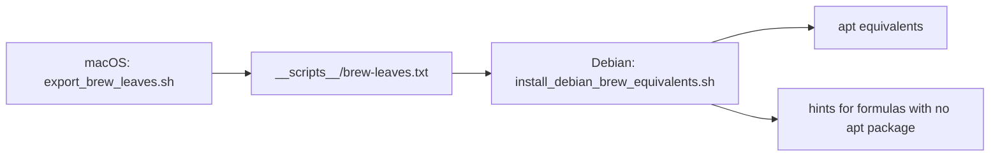

# Reference

## install.sh toggles

| Variable | Default | Effect |
|---|---|---|
| `DOTFILES_SKIP_OPTIONAL_TOOLS` | `0` | `1` skips everything but git, stow, curl |
| `DOTFILES_SKIP_MISE_INSTALL` | `0` | `1` skips `mise install` |
| `DOTFILES_INSTALL_ZSH` | `1` | `0` leaves the zsh package alone; `chsh` is never run either way |
| `DOTFILES_STOW_ADOPT` | `1` | `0` uses plain stow, conflicts fail instead of being adopted |
| `DOTFILES_INSTALL_DEBIAN_BREW_EQUIV` | `1` | Debian: install apt equivalents of `brew-leaves.txt` |
| `DOTFILES_INSTALL_OPENCODE` | `1` | OpenCode CLI via `https://opencode.ai/install` |
| `DOTFILES_INSTALL_OH_MY_OPENCODE` | `1` | oh-my-opencode via bunx or npx |
| `DOTFILES_OH_MY_OPENCODE_FLAGS` | all subscriptions `no` | passed to `oh-my-opencode install` |
| `DOTFILES_PLUGINS` | `~/.config/dotfiles/plugins` | plugin directory |

oh-my-opencode docs and releases: https://github.com/code-yeongyu/oh-my-opencode

```bash
DOTFILES_OH_MY_OPENCODE_FLAGS='--claude=yes --openai=yes --gemini=no --copilot=no --opencode-zen=no --zai-coding-plan=no' ./install.sh
```

## macOS vs Debian

| Tool | macOS | Debian |
|---|---|---|
| packages | Homebrew (bootstrapped if missing) | `apt-get`, plus `__scripts__/debian-packages.txt` |
| Neovim | `brew` | `install_nvim.sh`: release build in `~/.local/bin` (bookworm ships 0.7) |
| yazi | not installed by `install.sh` (not in the Brewfile) | `install_rust_tools.sh`: musl binary |
| joshuto | not installed by `install.sh` | skipped; `JOSHUTO_FORCE_CARGO=1 bash __scripts__/install_rust_tools.sh` |
| zsh plugins | `brew` | apt, history-substring-search vendored to `~/.zsh-plugins` |
| WM stack, LaunchAgents | yes | no |

## Debian bridge from Homebrew



```bash
./__scripts__/install_debian_brew_equivalents.sh --from-file ./__scripts__/brew-leaves.txt --dry-run
```

GUI and macOS-only formulas (`borders`, `sketchybar`, `mpv`) are skipped unless `--include-gui`.

## C tooling

| Role | Tool | Wired in |
|---|---|---|
| compiler | `clang` | system package |
| build | `cmake`, `ninja`, `ccache`, `bear` | `install.sh` optional tools |
| LSP | `clangd` | nvim |
| format | `clang-format` | nvim, Conform |
| lint | `cppcheck` | nvim, nvim-lint |
| debug | `codelldb` | nvim, nvim-dap |

```bash
printf '#include <stdio.h>\nint main(void) { puts("hello"); return 0; }\n' > /tmp/hello.c
clang -Wall -Wextra -std=c17 /tmp/hello.c -o /tmp/hello && /tmp/hello
cppcheck --enable=warning,style --std=c11 /tmp/hello.c
```

## Mermaid rendering

```bash
./__scripts__/render_mermaid.sh ./diagram.mmd svg
./__scripts__/render_mermaid.sh ./diagram.mmd png ./out/diagram.png
```

Needs `mmdc`: `mise use -g npm:@mermaid-js/mermaid-cli@latest`.

## Troubleshooting

| Symptom | Fix |
|---|---|
| Homebrew bootstrap fails on macOS | `xcode-select --install`, rerun `./install.sh` |
| no `sudo` on Debian | run the installer as root |
| stow conflict | `DOTFILES_STOW_ADOPT=1`, or move the file and rerun |
