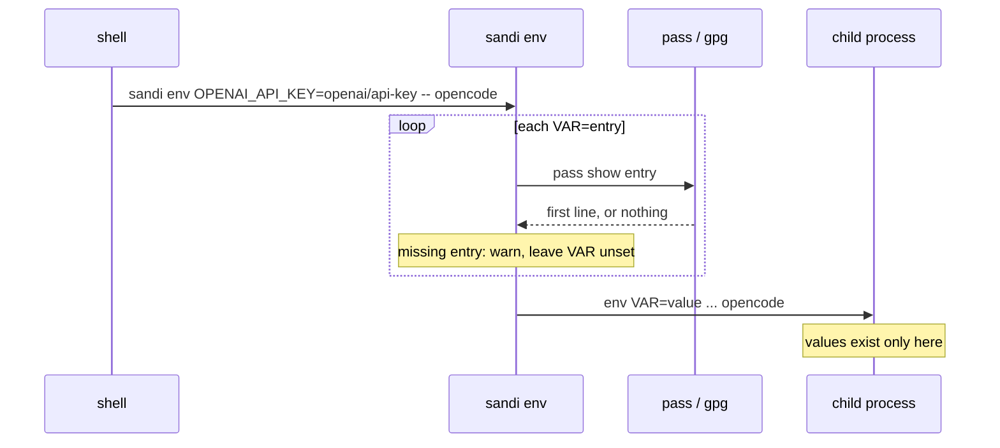
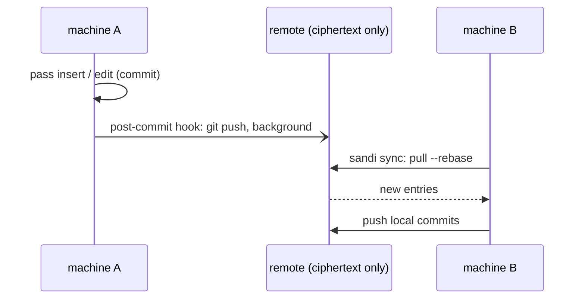
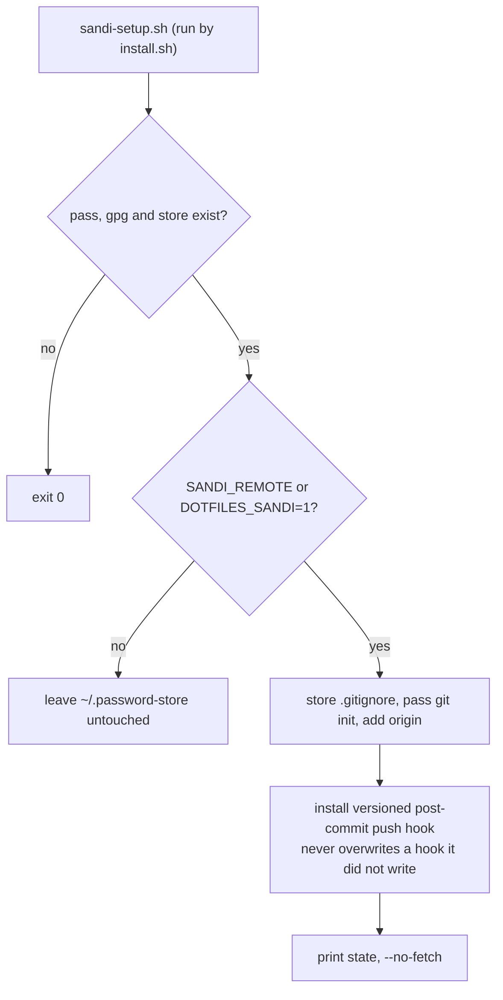
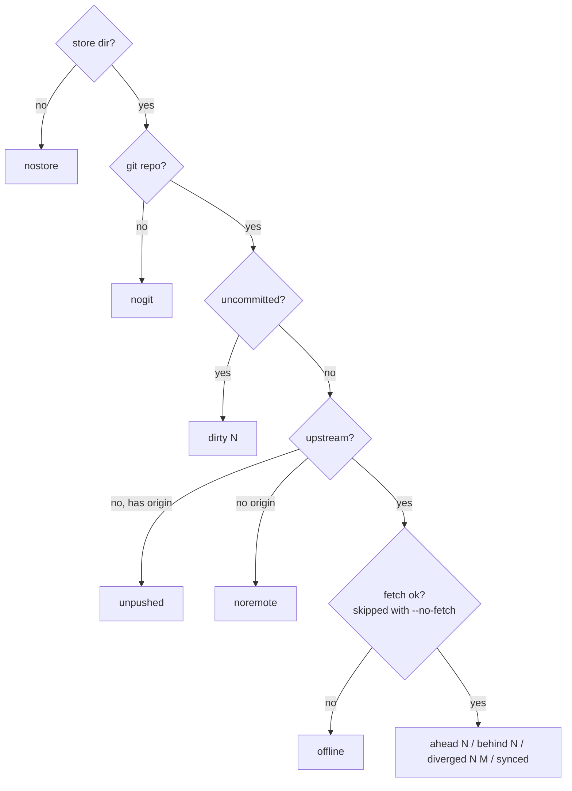
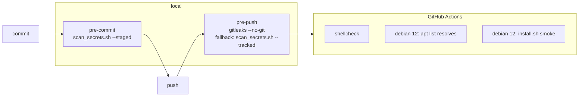

# Secrets

Secrets live in `pass`, encrypted to every key in `.gpg-id`. They are resolved into the one process that needs them and never written to disk.

## sandi env



Worked example: `zsh/.opencode_aliases`, since `opencode.json` reads its keys as `{env:VAR}`.

There is deliberately no `~/.secrets`. A plaintext dump sourced by every shell undoes the encryption, and it silently held empty values whenever a decrypt failed.

## Commands

| Command | Does |
|---|---|
| `sandi env VAR=entry ... -- cmd` | run `cmd` with resolved entries |
| `sandi sync` | `pull --rebase`, then `push` |
| `sandi st` | print sync state |
| anything else | passed through to `pass` (`show`, `find`, `insert`, `git`, ...); `find` matches filenames, so it is offline and decrypts nothing |

## Sync



The remote holds no key and can decrypt nothing. `.gpg` files are binary: two offline edits of the **same** entry conflict and are resolved by picking a side and re-inserting. Different entries merge cleanly.

## Setup (opt-in)



Set the remote in a machine-local module:

```bash
# ~/.config/dotfiles/modules/sandi.zsh
export SANDI_REMOTE="yourhost:path/to/password-store.git"
```

## State

`__scripts__/sandi-state.sh` is the single source for sync state. The first matching check wins:



The fetch uses `BatchMode=yes` and `ConnectTimeout=${SANDI_CONNECT_TIMEOUT:-3}`. The sketchybar item (`S:ok`, `S:^2`, `S:v1`) calls it with `--no-fetch` and ships commented out in `sketchybar/sketchybarrc`.

## Guardrails



| Piece | Notes |
|---|---|
| `scan_secrets.sh` | regexes for private keys, AWS, GitHub, Google, Slack, `sk-`, literal IPs in ssh `HostName`; extra `label\|regex` lines from `$DOTFILES_MODULES/forbidden-patterns.txt` |
| pre-push | scans the whole working tree, ignored files included |
| `install_git_hooks.sh` | **copies** `.githooks/*` into `.git/hooks`; re-run after editing a hook |
| smoke test | stow result, macOS-only dirs absent on Linux, nvim > 0.7, `zsh -i` with empty stderr, ssh and git configs parse |
