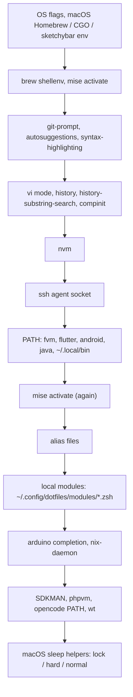
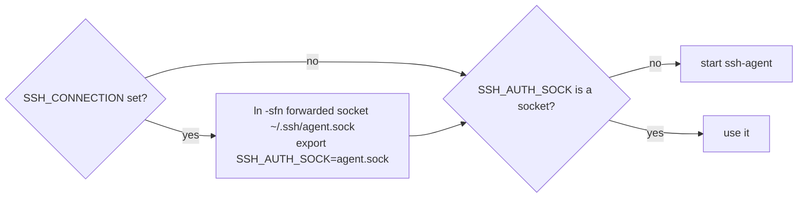

# Shell

## .zshrc load order

Modules load after every alias file, so a module can override any alias or function from this repo.

## Alias files

| File | Purpose |
|---|---|
| `.config_restart_aliases` | reload configs |
| `.fs_aliases` | filesystem, `oc-init` scaffold |
| `.functions` | general helpers |
| `.git_aliases` | git |
| `.docker_aliases` | docker |
| `.runpod_aliases` | runpod, uses `__scripts__/rpdash.py` |
| `.db_aliases` | databases |
| `.sandi_aliases` | `sandi`, see [secrets.md](secrets.md) |
| `.opencode_aliases` | `opencode` wrapped with `sandi env` |

## ssh agent socket

tmux panes keep the socket path they started with. The fixed symlink is re-pointed on every login, so a pane that outlives its connection still reaches the agent.

## Local hooks

| File | Read by |
|---|---|
| `~/.config/dotfiles/modules/*.zsh` | `zsh/.zshrc` |
| `~/.config/tmux/local.conf` | `tmux/tmux.conf`, `source-file -q` |
| `~/.config/nvim/lua/local/init.lua` | `nvim/init.lua`, `pcall(require, "local")` |

All are optional and silent when missing. The full hook list is in [plugins.md](plugins.md).
